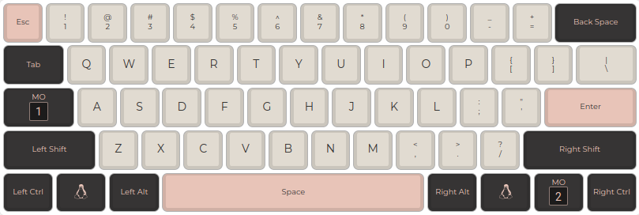
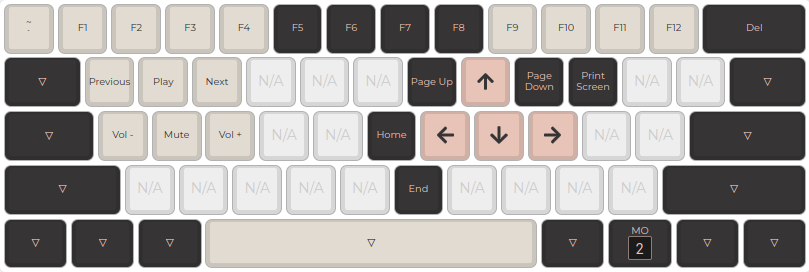
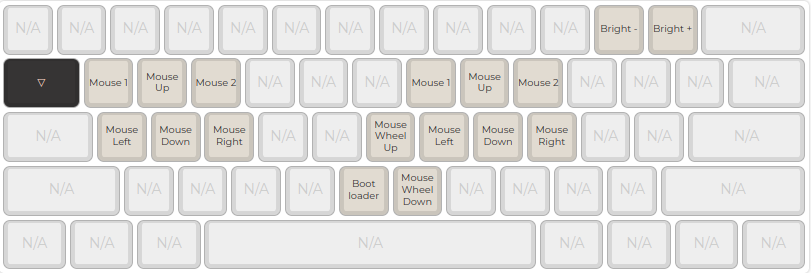
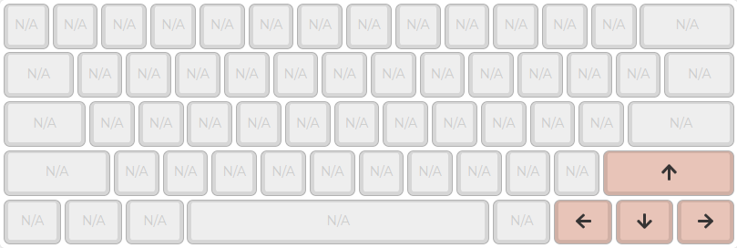

# M60 ZMK configuration

Firmware: https://github.com/zmkfirmware/zmk/

Board: https://github.com/makerdiary/m60

Layout: Import [m60_layout_60_ansi.json](m60_layout_60_ansi.json) on https://keyboard.makerdiary.com/

## Layers

### Default

### Navigation and media layer

### Tools layer (In progress)

### Tap layer

